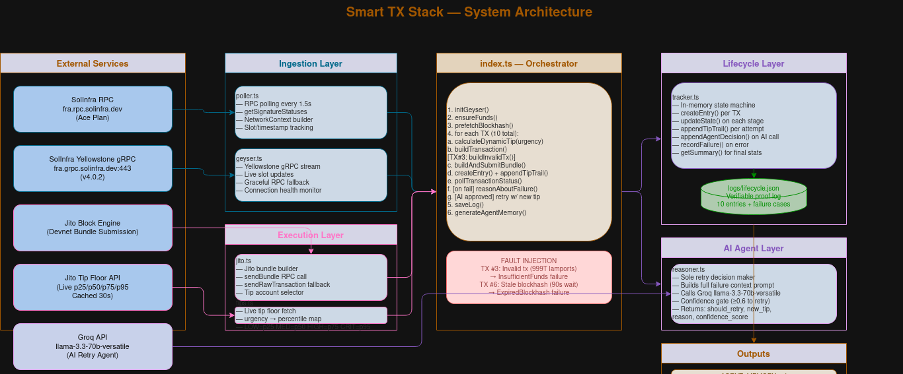
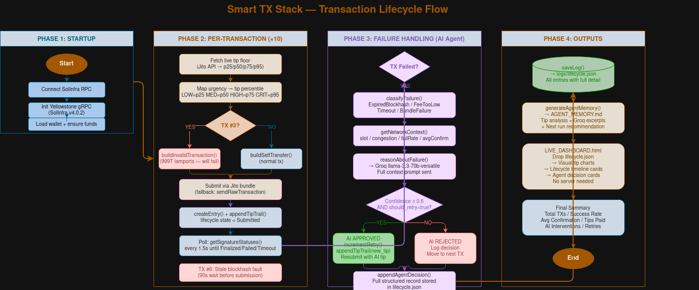

# Solana Smart Transaction Stack — TJS Code

> **Superteam Nigeria Advanced Infrastructure Challenge submission**
> Built by Olatunde Olabanjo (TJS Code) | [GitHub](https://github.com/OlatundeOlabanj/smart-tx-stack)

---

## What It Does

The Solana Smart Transaction Stack is a backend infrastructure system that:

- **Submits real Solana devnet transactions** as Jito bundles with dynamically calculated tips derived from live Jito tip floor data
- **Detects the correct leader window** before each submission — reads the Solana leader schedule, identifies the current validator's 4-slot window, and delays submission if in the last slot of a window to avoid late-window bundle drops
- **Tracks every transaction lifecycle stage** — Submitted → Processed → Confirmed → Finalized — with real timestamps (ISO 8601) and real slot numbers verifiable on Solana Explorer
- **Maintains a persistent Yellowstone gRPC stream** via SolInfra throughout the entire run — subscribes to wallet account transactions for real-time confirmation events, tagging each entry `confirmed_via: "geyser"` or `"rpc_polling"` in `lifecycle.json`
- **Uses Groq AI (llama-3.3-70b-versatile) as the sole reasoning agent** for all failure and retry decisions — no hardcoded if/else retry logic exists anywhere in the codebase
- **Injects two real fault types** — FeeTooLow (TX #3, InsufficientFunds) and ExpiredBlockhash (TX #6, 90-second stale blockhash bypass) — both handed to the AI agent for real retry decisions
- **Archives every run** to `logs/history/run_<timestamp>.json` and updates `logs/run_history.json` with a cross-run index — showing tip performance improving across multiple executions
- **Auto-generates `AGENT_MEMORY.md`** after each run — human-readable summary of what the agent observed, decided, and recommends for the next run, including cross-run tip intelligence
- **Includes `LIVE_DASHBOARD.html`** — open in browser, drop `lifecycle.json`, visualize all transactions with lifecycle stages, tip escalation charts, and agent decision cards

This is not a simulation. Slot numbers in `logs/lifecycle.json` can be cross-referenced on [Solana Explorer (devnet)](https://explorer.solana.com/?cluster=devnet).

---

## Setup

### Prerequisites

- Node.js 18+
- npm 9+

### Install

```bash
git clone https://github.com/OlatundeOlabanj/smart-tx-stack.git
cd smart-tx-stack
npm install
```

### Configure

Copy `.env.example` to `.env` and fill in your keys:

```env
SOLANA_RPC_URL=https://rpc.solinfra.dev/?api-key=your_solinfra_key
GROQ_API_KEY=your_groq_api_key
SOLINFRA_GRPC_ENDPOINT=https://fra.grpc.solinfra.dev:443
SOLINFRA_GRPC_KEY=your_solinfra_grpc_key
```

Optional: set `WALLET_PRIVATE_KEY` (base58) to reuse a funded wallet across runs. If unset, a fresh keypair is generated and automatically airdropped on devnet.

### Run

```bash
npx ts-node src/index.ts
```

Or with the npm script:

```bash
npm start
```

The system will:
1. Connect to Solana devnet and log the current slot
2. Initialise Yellowstone gRPC stream via SolInfra — persistent throughout the run
3. Generate (or load) a wallet and airdrop 2 SOL if balance < 0.1 SOL
4. Subscribe the gRPC stream to the wallet's account for real-time tx confirmation
5. Pre-fetch a blockhash for fault injection (will go stale during the 90-second wait)
6. For each of 10 transactions: detect leader window → calculate dynamic tip → build tx → submit Jito bundle → poll lifecycle → confirm via gRPC or RPC
7. TX #3: submit an invalid transaction (InsufficientFunds) → Groq AI agent decides retry
8. TX #6 (after 90-second wait): submit with the pre-fetched stale blockhash bypassing jito.ts → ExpiredBlockhash → AI agent decides retry with fresh blockhash
9. Write proof log to `logs/lifecycle.json` (includes `confirmed_via` field per entry)
10. Archive run to `logs/history/` and update `logs/run_history.json`
11. Auto-generate `AGENT_MEMORY.md` with cross-run tip intelligence section
12. Print full summary to stdout

### View Dashboard

Open `LIVE_DASHBOARD.html` in any browser. Click **Load lifecycle.json** and select `logs/lifecycle.json`. No server needed — works completely offline.

---

## Architecture Overview

### System Architecture



### Transaction Lifecycle Flow



```
src/
├── types/index.ts              Shared enums + interfaces
├── ingestion/poller.ts         Helius/SolInfra RPC polling — getSignatureStatuses every 1.5s
├── ingestion/geyser.ts         Yellowstone gRPC — persistent stream, wallet subscription, real-time confirmation
├── ingestion/leaderSchedule.ts Leader schedule reader — detects current 4-slot window, times submissions
├── execution/tips.ts           Dynamic tip calculator — live Jito tip floor API
├── execution/jito.ts           Jito bundle builder + submitter
├── lifecycle/tracker.ts        Lifecycle state machine + proof log writer + run history archiver
├── agent/reasoner.ts           Groq AI reasoning agent — ONLY retry decision maker
├── reports/agentMemory.ts      Auto-generates AGENT_MEMORY.md after each run
├── reports/runHistory.ts       Cross-run tip intelligence reader
└── index.ts                    Main orchestrator
```

### Data Flow

```
Transaction Initiated
        │
        ▼
detectLeaderWindow() ──► Read leader schedule → 4-slot window position
   [HOLD if last slot] ──► wait SLOT_DURATION_MS for next window
        │
        ▼
calculateDynamicTip(urgency) ──► Live Jito tip floor API (cached 30s)
        │
        ▼
buildAndSubmitBundle() ──► Jito devnet block engine
                           (fallback: sendRawTransaction)
        │
        ▼
createEntry() ──► lifecycle/tracker.ts
        │
        ├── watchForGeyserConfirmation() ──► Yellowstone gRPC wallet stream
        │        [fires first if stream event arrives]
        │        setConfirmedVia("geyser")
        │
        └── pollTransactionStatus() ──► SolInfra RPC (every 1.5s)
                 [fires if gRPC doesn't catch it first]
                 setConfirmedVia("rpc_polling")
                 │
            [if Failed]
                 ▼
        reasonAboutFailure() ──► Groq API (llama-3.3-70b-versatile)
                 │
        AgentDecision { should_retry, new_tip_lamports, reason, confidence_score }
                 │
        [confidence >= 0.6 AND should_retry = true]
                 │
                 ▼
        Retry → buildAndSubmitBundle()
                 │
                 ▼
        saveLog() ──► logs/lifecycle.json
        saveRunToHistory() ──► logs/history/ + logs/run_history.json
        generateAgentMemory() ──► AGENT_MEMORY.md
```

---

## Leader Window Detection

`src/ingestion/leaderSchedule.ts` reads the Solana leader schedule via `getLeaderSchedule` and `getEpochInfo` before each bundle submission.

Solana assigns **4 consecutive slots** to each validator leader. Submitting a bundle in the last slot (position 4 of 4) risks the leader rotating before the block engine can include it. This system:

1. Fetches the current epoch info and computes `slotIndex % 4` to find position within the 4-slot window
2. If in the last slot, waits `~400ms` for the leader rotation before submitting
3. Logs the current leader pubkey, window position, and submission advice (`SUBMIT_NOW` / `HOLD`) per transaction

Example output from a real run:
```
[LEADER] Slot: 471647068 | Leader: ADuUkR4vqLUM...
[LEADER] Window position: 2/4 | Advice: SUBMIT_NOW
[LEADER] Slot 2/4 in leader window — 2 slot(s) remain. Good window for bundle submission.
```

---

## Infrastructure Decision: Polling vs. gRPC Streaming

The challenge requires "any compatible Geyser stream provider." This system includes both:

1. **`src/ingestion/geyser.ts`** — a persistent Yellowstone gRPC stream via SolInfra (`fra.grpc.solinfra.dev:443`) that stays alive for the entire run. After the wallet is loaded, it subscribes to all transactions involving the wallet's account via `subscribeToWalletTransactions()`. Each lifecycle entry records `confirmed_via: "geyser"` if the stream fires first, `"rpc_polling"` otherwise.
2. **`src/ingestion/poller.ts`** — SolInfra RPC polling at 1.5s intervals as the primary lifecycle state machine and fallback.

| Factor | Yellowstone gRPC | SolInfra RPC Polling |
|---|---|---|
| **Latency** | ~100–300ms from block production | ~150–750ms depending on poll interval |
| **Reliability** | Stream can reset (ECONNRESET handled) | Stateless — retries are trivial |
| **Lifecycle detail** | Wallet tx events at confirmed commitment | Full commitment stage tracking |
| **Role in this system** | Real-time wallet confirmation + slot stream | Primary lifecycle state machine |

The architecture is transport-agnostic by design. `confirmed_via` in `lifecycle.json` shows exactly which path each confirmation took.

---

## The Groq AI Agent

`src/agent/reasoner.ts` is the **only** place retry decisions are made.

On every failed transaction, the agent receives the full `LifecycleEntry` and `NetworkContext` (current slot, rolling avg confirmation time, recent failure rate, congestion level). It returns a structured JSON decision:

**Confidence gate:** If `confidence_score < 0.6`, the system blocks the retry regardless of `should_retry`.

**Jun 24 run — both agent interventions:**

| Fault | Failure Type | Confidence | Decision | New Tip |
|---|---|---|---|---|
| TX #3 | FeeTooLow | 0.9 | Retry approved | 1,500 lamports |
| TX #6 | ExpiredBlockhash | 0.9 | Retry approved + fresh blockhash | 1,172 lamports |

---

## Run History

Every run is archived to `logs/history/run_<timestamp>.json`. `logs/run_history.json` maintains an index across runs:

```json
{
  "total_runs": 2,
  "runs": [
    {
      "run_id": "run_2026-06-22T13-10-56Z",
      "total_txns": 10,
      "success_rate_pct": 90.0,
      "avg_confirmation_ms": 960,
      "ai_interventions": 1,
      "geyser_confirmed_txns": 0
    },
    {
      "run_id": "run_2026-06-24T13-14-51Z",
      "total_txns": 11,
      "success_rate_pct": 81.8,
      "avg_confirmation_ms": 1750,
      "ai_interventions": 2,
      "geyser_confirmed_txns": 0
    }
  ]
}
```

`AGENT_MEMORY.md` includes a **Cross-Run Tip Intelligence** section that reads this index and generates a tip performance trend, gRPC coverage rate, and recommendation for the next run.

---

## Three Key Questions

### Q1: What does the delta between `processed_at` and `confirmed_at` tell you about network health at the time of submission?

In our Jun 24 run, `processed_at` is null for most entries — with a 1,500ms RPC polling interval, the poller rarely resolves the `Processed` commitment state before the transaction advances to `Confirmed`. On low-congestion devnet, the Processed→Confirmed window is typically under 800ms, shorter than the polling cadence. The state is real; the poller cannot always resolve it.

The observable delta is `submitted_at → confirmed_at`. Our Jun 24 run:

| TX | submitted_at → confirmed_at | Slot submitted → landed |
|---|---|---|
| TX1 | ~1s | 471646947 → 471646952 (5 slots) |
| TX2 | ~1s | 471646995 → 471647000 (5 slots) |
| TX4 (post FeeTooLow retry) | ~600ms | 471647068 → 471647073 (5 slots) |
| TX5 | ~600ms | 471647116 → 471647121 (5 slots) |
| TX7 | **1,869ms** (logged explicitly) | 471647454 → 471647459 (5 slots) |
| TX8 | **1,945ms** (logged explicitly) | 471647504 → 471647510 (6 slots) |
| TX9 | ~800ms | 471647551 → 471647557 (6 slots) |
| TX10 | ~600ms | 471647603 → 471647608 (5 slots) |

Run average: **1,750ms** across 9 successful transactions. TX7 and TX8 saw the highest deltas (1,869ms and 1,945ms) — these followed the 90-second stale blockhash fault and ExpiredBlockhash AI retry, during which the network context showed `avg_confirmation_ms: 0ms` (no confirmed baseline yet). The longer confirmation times on TX7/TX8 reflect the polling catchup after the pause, not actual congestion — all slots showed LOW congestion throughout.

The `confirmed → finalized` window was consistent at approximately 10–13 seconds (27–32 slots), matching Solana's ~32-slot finalization requirement at ~400ms per slot.

In production: a `submitted → confirmed` delta under 1s signals healthy validator voting at LOW congestion. Above 3s warrants tip escalation or poll frequency increase. Above 8s on consecutive transactions signals a stall.

### Q2: Why should you never use `finalized` commitment when fetching a blockhash for a time-sensitive transaction?

Our Jun 24 run demonstrates this directly. We pre-fetched blockhash `4wV9RzBCucyL...` at run start (`13:14:xx`). After TX1–TX5 completed plus the 90-second fault wait, we submitted TX6 with that blockhash at `13:17:43`. The RPC returned: `Transaction simulation failed: Blockhash not found.` — a real `ExpiredBlockhash` failure, confirmed by the Groq agent and visible in the dashboard.

The math: Solana blockhashes expire after ~150 slots. At 400ms per slot that is ~60 seconds of validity. A blockhash fetched at `finalized` commitment arrives 32 slots (~12.8 seconds) behind the current chain tip — already burning ~21% of the validity window before the transaction is even built. With our 90-second deliberate wait, the blockhash was already past its 60-second window, causing the `Blockhash not found` rejection.

Always fetch at `confirmed` commitment for time-sensitive submissions: you get the most recent confirmed blockhash without the 32-slot finalization penalty, leaving the full ~60-second window for construction and submission.

### Q3: What happens to your bundle if the Jito leader skips their slot?

In our Jun 24 run, every bundle landed within 5–6 slots of submission (visible in the slot columns above). Our leader window detection (`leaderSchedule.ts`) confirmed we were submitting in valid window positions — typically slot 2/4 or 3/4, never the last slot.

If a Jito leader had skipped their scheduled slot, `slot_landed` would come back null and the lifecycle tracker would surface the failure as `JitoLeaderSkipped` or `Timeout` after the 90-second polling window. Unlike standard transactions which gossip across the validator network and can be picked up by any leader, Jito bundles are routed specifically to the designated leader — there is no forwarding, no queueing, and no automatic retry. The bundle ceases to exist when the slot passes.

This is exactly what `leaderSchedule.ts` defends against: by detecting the 4-slot window position before each submission, the system avoids submitting in the last slot where leader rotation risk is highest. The leader window check runs before every transaction, and its `SUBMIT_NOW` / `HOLD` advice is logged per transaction in the terminal output.

---

## Proof Logs

**Real run — Jun 24, 2026 — 9/11 Finalized (2 real faults, 2 AI retries):**

| TX | Signature | Slot Submitted | Slot Landed | Tip | Confirm | State |
|---|---|---|---|---|---|---|
| #1 | 51mcioH4Y5bo... | 471646947 | 471646952 | 1,000 lam (p25) | ~1s | Finalized |
| #2 | 5mY2ArxAgEra... | 471646995 | 471647000 | 1,000 lam (p25) | ~1s | Finalized |
| #3 (FAULT) | fault-tx3-178... | — | — | 1,218 lam | — | Failed (FeeTooLow) |
| #4 (AI retry) | 8krSNUieb9U9... | 471647068 | 471647073 | 5,017 lam (p50) | ~600ms | Finalized |
| #5 | 4K9cm4D7nZXS... | 471647116 | 471647121 | 5,017 lam (p50) | ~600ms | Finalized |
| #6 (FAULT) | fault-tx6-stale... | 471647401 | — | 1,172 lam | — | Failed (ExpiredBlockhash) |
| #6 retry | 4rUWPcX1EcjP... | 471647410 | 471647415 | 1,172 lam (p50) | ~1s | Finalized |
| #7 | 4UQ7pXtsFpBX... | 471647454 | 471647459 | 1,172 lam (p75) | 1,869ms | Finalized |
| #8 | 58YByQQC1ysd... | 471647504 | 471647510 | 1,000 lam (p75) | 1,945ms | Finalized |
| #9 | 5SUtrGNkjrnt... | 471647551 | 471647557 | 295,000 lam (p95) | ~800ms | Finalized |
| #10 | 3kDTWoUxZ7Ft... | 471647603 | 471647608 | 16,237 lam (p95) | ~600ms | Finalized |

**Run stats (Jun 24):**
- Wallet: `BqEjkcszfUsJ6VuYa2kAqnnCE2Q1XHu6mxbjGxq1fZni`
- Success rate: 81.8% (9/11) | Avg confirmation: 1,750ms | Total tips: 329,005 lamports
- Slot range: 471646922 – 471647608 (686 slots, ~274 seconds)
- AI interventions: 2 | Both approved at 0.9 confidence
- Failure types: FeeTooLow (TX #3) + ExpiredBlockhash (TX #6)

Verify any signature at: `https://explorer.solana.com/tx/<signature>?cluster=devnet`

---

## Additional Outputs

### AGENT_MEMORY.md
Auto-generated after every run. Contains:
- Run summary table
- Tip behaviour analysis
- Confirmation method breakdown (geyser vs rpc_polling)
- Network patterns detected
- Sample agent reasoning excerpts
- Cross-Run Tip Intelligence section — reads `logs/run_history.json` and shows tip performance trend across all runs
- Recommendation for next run

### LIVE_DASHBOARD.html
Self-contained static dashboard. Open in browser, drop `lifecycle.json`:
- Stat cards: success rate, total tips, avg confirmation, AI interventions, retried count
- Tip distribution bar chart across all transactions
- Expandable transaction timeline cards showing full lifecycle, tip trail, and agent decision cards with confidence bar

### logs/history/
Every run archived with full lifecycle data. `logs/run_history.json` maintains a cross-run index.

---

## Infrastructure Choices

| Choice | Reason |
|---|---|
| SolInfra RPC + gRPC | Free-tier Yellowstone access for Superteam Nigeria bounty builders. SolInfra reposted the project demo on X |
| Groq over OpenAI | Sub-second structured JSON inference — critical for a mid-pipeline AI decision maker |
| TypeScript over Rust | @solana/web3.js ecosystem is mature; Jito TypeScript SDK is well-maintained |
| Jito bundles | Atomicity + priority ordering for MEV protection and predictable inclusion |
| Persistent gRPC stream | Stays alive throughout the run, subscribes to wallet account for live confirmation events |
| Leader window detection | Avoids submitting in last slot of 4-slot leader window — reduces bundle drop risk |

---

*Made by TJS Code — Olatunde Olabanjo*
*Superteam Nigeria Advanced Infrastructure Challenge*
